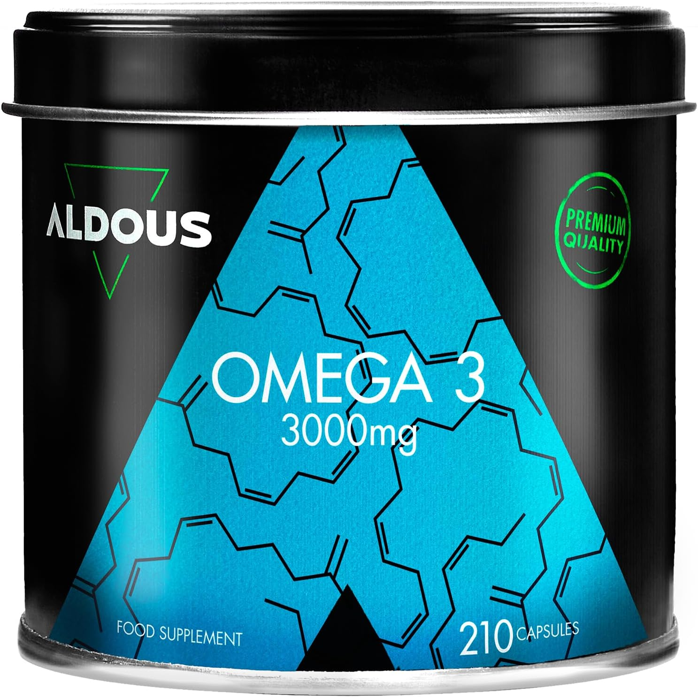
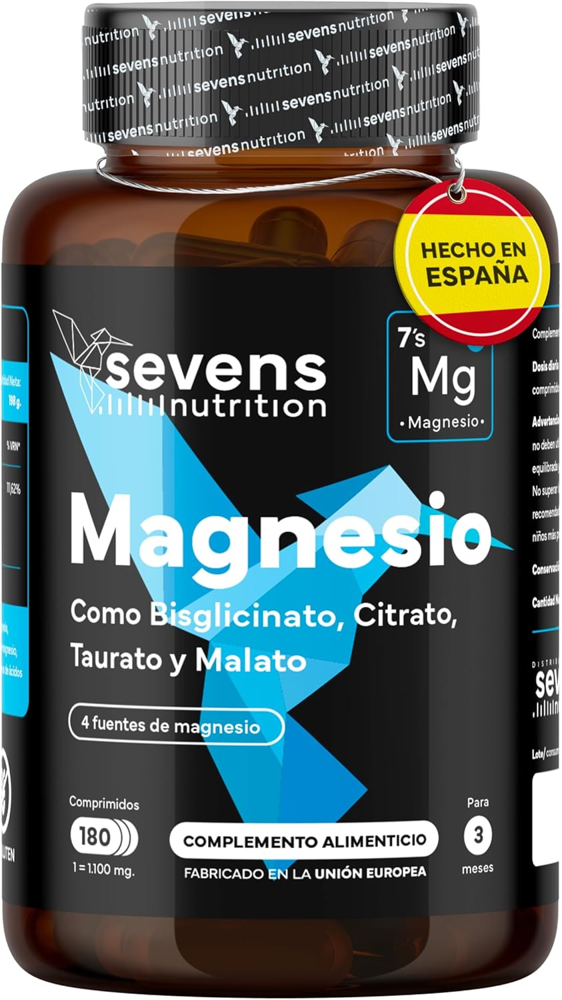
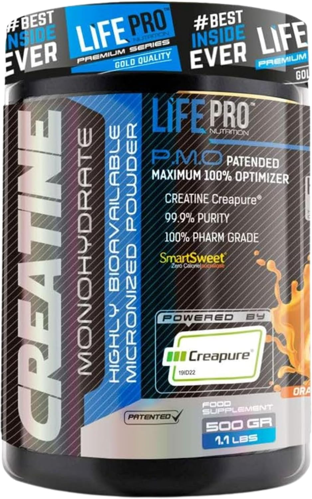
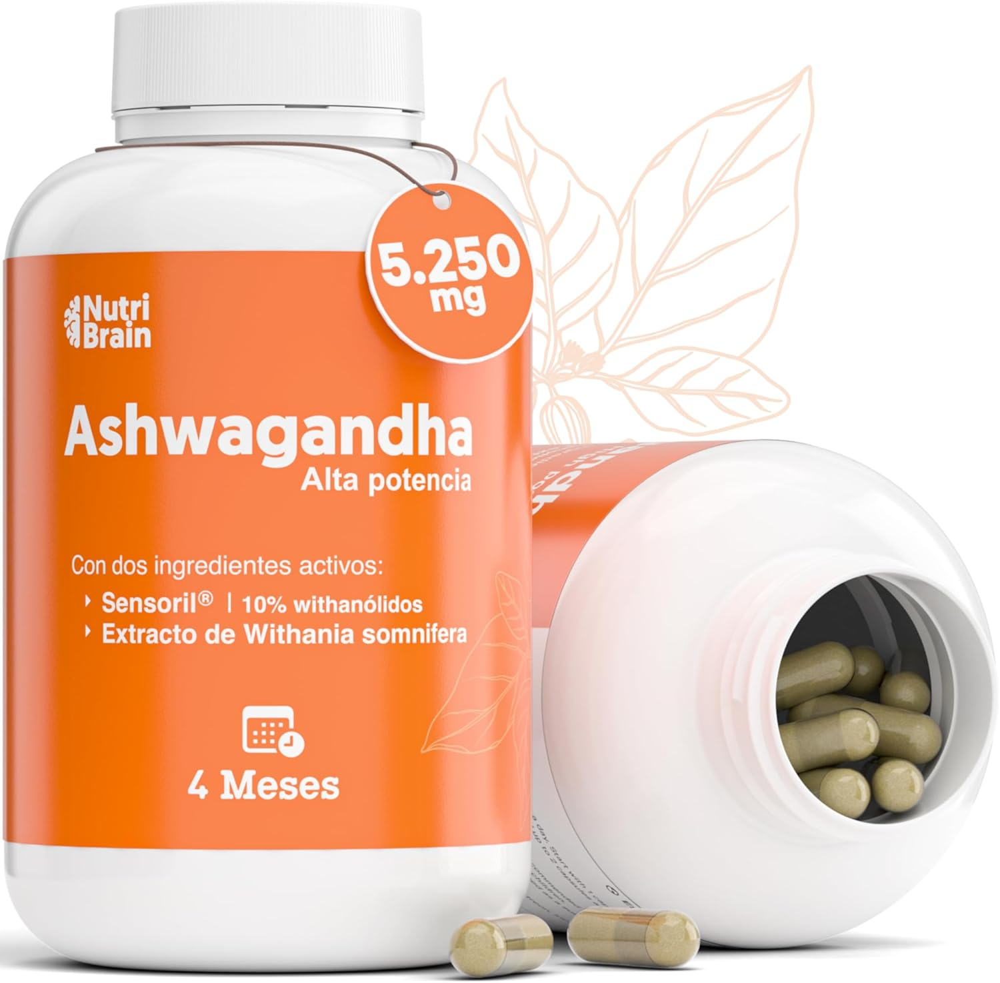
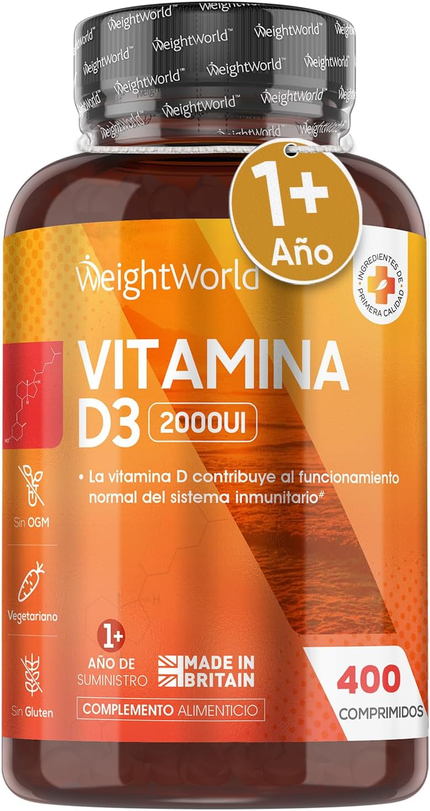

En el mundo del **biohacking**, los suplementos son fundamentales para optimizar tanto el rendimiento físico como el mental. A continuación, te presentamos una guía con los 5 mejores suplementos para mejorar tu salud y potenciar tu rendimiento.

## 1. Omega-3 (Ácidos Grasos Esenciales)

Los ácidos grasos Omega-3 son cruciales para la salud cerebral y cardiovascular, ayudando a reducir la inflamación y mejorar la función cognitiva.

**Beneficios:**
- Mejora la función cerebral.
- Reduce la inflamación.
- Favorece la salud cardiovascular.

🔗 [<a href="https://www.amazon.es/dp/B0D2CZKM1B?tag=productstop06-21" target="_blank" rel="noopener noreferrer">Comprar Omega-3 en Amazon</a>]

---

## 2. Magnesio

El magnesio es vital para la relajación muscular, la reducción del estrés y la mejora de la calidad del sueño, ayudando a la producción de serotonina.

**Beneficios:**
- Mejora la calidad del sueño.
- Reduce la fatiga.
- Favorece la recuperación muscular.

🔗 [<a href="https://www.amazon.es/dp/B0D2Y15NJ5?tag=productstop06-21" target="_blank" rel="noopener noreferrer">Comprar Magnesio en Amazon</a>]

---

## 3. Creatina Monohidratada

La creatina es uno de los suplementos más estudiados y eficaces para aumentar la fuerza y la masa muscular, permitiendo entrenamientos intensos y una mejor recuperación.

**Beneficios:**
- Incrementa la fuerza y resistencia muscular.
- Mejora la recuperación post-entrenamiento.
- Aporta energía durante entrenamientos intensos.

🔗 [<a href="https://www.amazon.es/dp/B08Q7SLNBG?tag=productstop06-21" target="_blank" rel="noopener noreferrer">Comprar Creatina en Amazon</a>]

---

## 4. Ashwagandha

Esta hierba adaptógena reduce el estrés y mejora la concentración, ayudando a equilibrar los niveles hormonales y a aumentar la resistencia física y mental.

**Beneficios:**
- Reduce el estrés y la ansiedad.
- Aumenta la energía y la concentración.
- Favorece el equilibrio hormonal.

🔗 [<a href="https://www.amazon.es/dp/B09YVNBCPB?tag=productstop06-21" target="_blank" rel="noopener noreferrer">Comprar Ashwagandha en Amazon</a>]

---

## 5. Vitamina D3

La vitamina D3 es esencial para la salud ósea, la función inmune y el bienestar general, especialmente en personas con poca exposición solar.

**Beneficios:**
- Fortalece los huesos y el sistema inmunológico.
- Mejora el estado de ánimo.
- Potencia la salud general.

🔗 [<a href="https://www.amazon.es/dp/B08J48DNCN?tag=productstop06-21" target="_blank" rel="noopener noreferrer">Comprar Vitaminda D3 en Amazon</a>]

---

## Conclusión

Estos suplementos pueden marcar la diferencia en tu rendimiento físico y mental. Recuerda siempre consultar con un especialista antes de incorporar nuevos suplementos a tu dieta. ¡Comparte tu experiencia y déjanos saber cuál ha sido tu favorito!

*¿Tienes alguna duda o sugerencia? ¡Déjanos tu comentario!*
